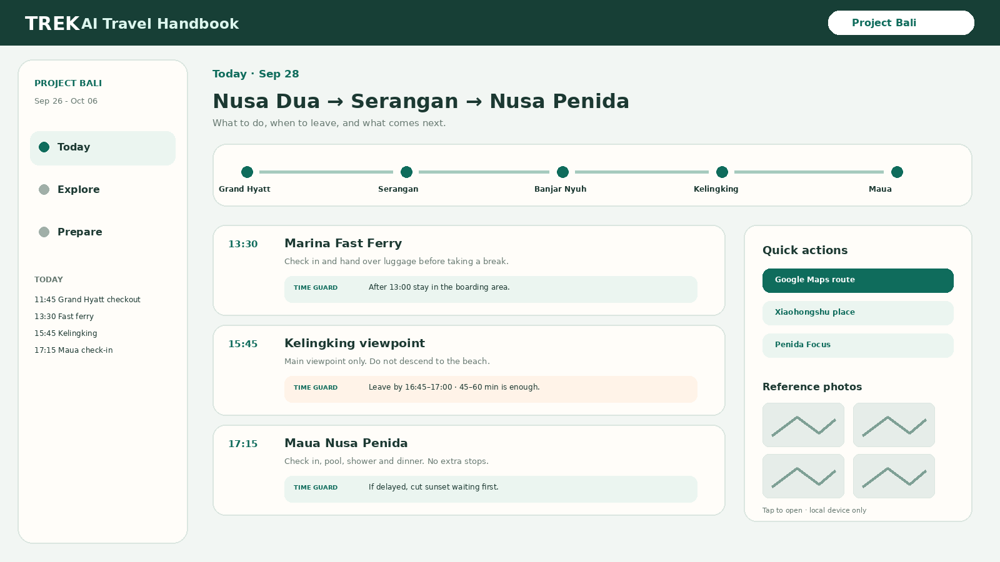

# AI Travel Handbook for TREK

Trip-native Travel Mode for TREK. TREK remains the source of truth for collaboration, itinerary, bookings, files, packing and budgets; this plugin turns live trip data into a compact phone-first execution interface.

## What it does

- **Today** — execution view for the selected TREK day with time, stop order, practical notes, stop-loss timing, photography guidance, next-step context and direct map/search actions.
- **Explore** — separates scheduled places from optional places and exposes destination-specific attraction, experience, food, shopping, hotel and transport choices.
- **Prepare** — reads packing, reservations, accommodation and files without creating a second conflicting checklist.
- **Travel enrichment** — stores handbook-only fields such as duration, risk, photography advice and Xiaohongshu queries in namespaced plugin metadata instead of forking TREK core tables.
- **Realtime refresh** — reacts to TREK trip events and re-syncs the current trip snapshot for collaborators.
- **Project Bali importer** — can seed an empty trip with the current 11-day Project Bali route, coordinates, assignments and handbook metadata. It refuses non-empty trips to avoid duplicates.
- **Agent-ready architecture** — TREK MCP can remain the write path for an AI agent while the plugin renders those changes as Travel Mode.

Core facts stay in TREK: trip dates, members, days, itinerary order, places/coordinates, accommodation, reservations, packing, files and costs. Handbook presentation data is namespaced under the plugin metadata key `handbook`.

Example enrichment:

```json
{
  "duration": "45–60m",
  "risk": "中",
  "practicalNote": "先完成主观景台，再决定是否继续走。",
  "timeGuard": "最晚 16:45 离开。",
  "photo": "用广角交代悬崖尺度。",
  "xhs": "Kelingking 精灵坠崖 出片"
}
```

## Screenshots



The screenshot represents the trip-page experience: Today execution cards, live route context, Explore alternatives and Prepare status in a single TREK-native surface.

## Permissions

| Permission | Why it is needed |
| --- | --- |
| `db:read:trips` | Read the active trip, its days, places, accommodation, reservations and itinerary snapshot. |
| `db:read:packing` | Surface TREK packing state inside Prepare without duplicating it. |
| `db:read:files` | Surface trip documents and attachments inside Prepare. |
| `db:write:trips` | Set current trip fields during the optional Project Bali import into an empty trip. |
| `db:write:places` | Create exact route places and coordinates during the optional importer. |
| `db:write:days` | Create dated day records during the optional importer. |
| `db:write:itinerary` | Assign imported places to their correct days and order. |
| `db:meta` | Store handbook-only enrichment such as duration, risk, practical notes and photo guidance without altering TREK core schema. |
| `hook:trip-warning-provider` | Add trip-level handbook warnings when execution-critical information is missing. |
| `hook:place-detail-provider` | Add handbook enrichment rows to TREK native place-detail views. |

All writes remain subject to TREK membership and permission checks and are visible through TREK's plugin activity/audit model.

## Setup

Production in this repository uses `../../trek-deploy/compose.yaml`. The raw plugin source is not mounted directly into TREK. A one-shot build container runs the official `trek-plugin-sdk pack`, expands the `<!-- trek:ui -->` production bridge/design kit, and unpacks the resulting package into TREK's persistent plugin directory before TREK starts.

After TREK starts:

1. Open **Admin → Plugins**.
2. Use **Rescan** if AI Travel Handbook is not already listed.
3. Review the permission table and activate the plugin.
4. Open a trip and use its **AI Travel Handbook** trip page.
5. For a new empty demo trip only, use **一键导入 Project Bali**.
6. Add collaborators through TREK normally; Plan edits remain stored and synchronized by TREK.

For local development and registry validation:

```bash
cd trek-plugins/ai-travel-handbook
npm run dev
npm run validate
npm run pack
```

The repository workflow also runs `trek-plugin-sdk validate` whenever the plugin or travel-handbook project changes.
